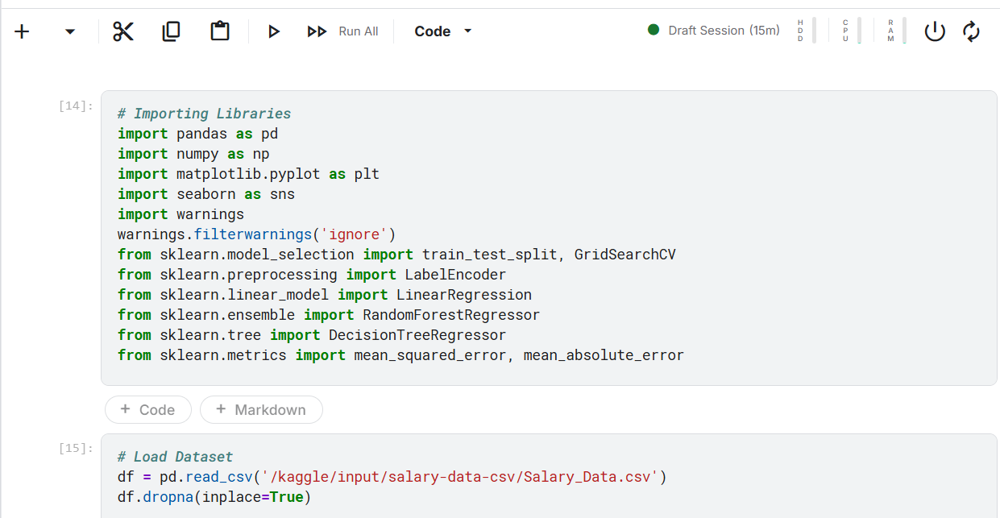
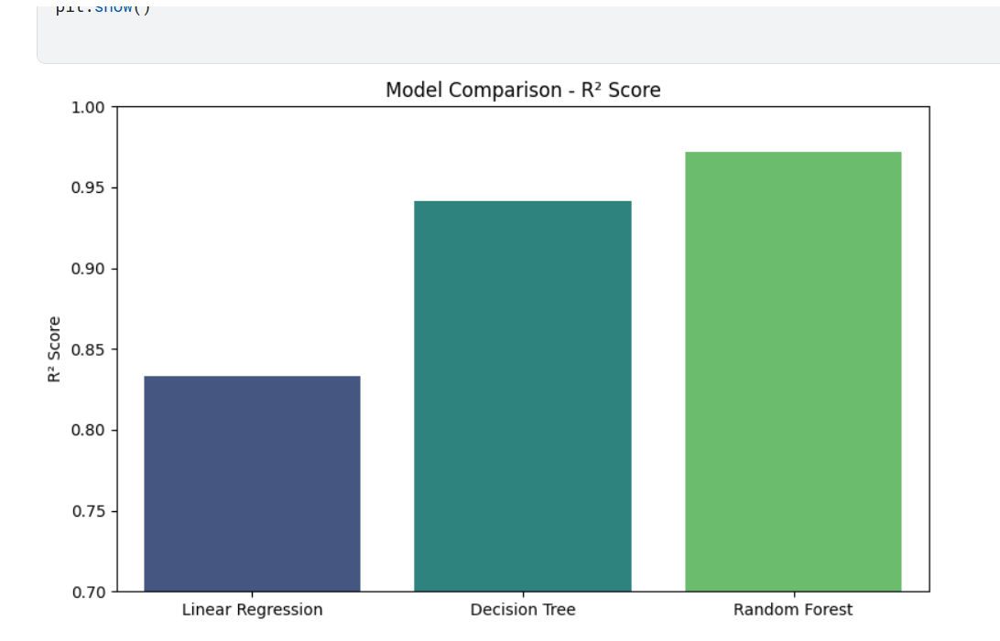

# Employee Salary Prediction using Machine Learning

This project predicts employee salaries based on various features such as age, education level, years of experience, job title, and gender.

## 📊 Dataset Features
- **Age**
- **Gender**
- **Education Level**
- **Job Title**
- **Years of Experience**
- **Salary**

## 🔍 Exploratory Data Analysis (EDA)
Performed analysis on:
- Distribution of Gender and Education
- Top 10 highest paying job titles
- Relationship of Salary with Age, Education, and Experience

## 🧼 Data Preprocessing
- Removed null values
- Handled categorical variables with Label Encoding and One-Hot Encoding
- Outlier detection using IQR method
- Converted target to numerical format

## 🤖 ML Models Used
1. **Linear Regression**
2. **Decision Tree Regressor**
3. **Random Forest Regressor** (Best performance)

### ✅ Best Model:
- **Random Forest Regressor**
- **R² Score:** 0.971
- **MAE:** ~₹4,200
- **RMSE:** ~₹5,300

## 📈 Feature Importance
A bar chart visualizes which features contribute most to predicting salary.

## 📌 Conclusion
- Random Forest outperformed other models in terms of accuracy and error metrics.
- Model can be used to help HR teams determine competitive salaries based on experience, education, and role.

## 🚀 Future Scope
- Build a web interface using Flask or Streamlit
- Integrate with real-time HRMS systems
- Add more job-specific features (industry, certifications)

## 📁 Files Included
- `Salary_Prediction.ipynb` – main notebook
- `Salary_Data.csv` – dataset used

## Images of sample code and graph

